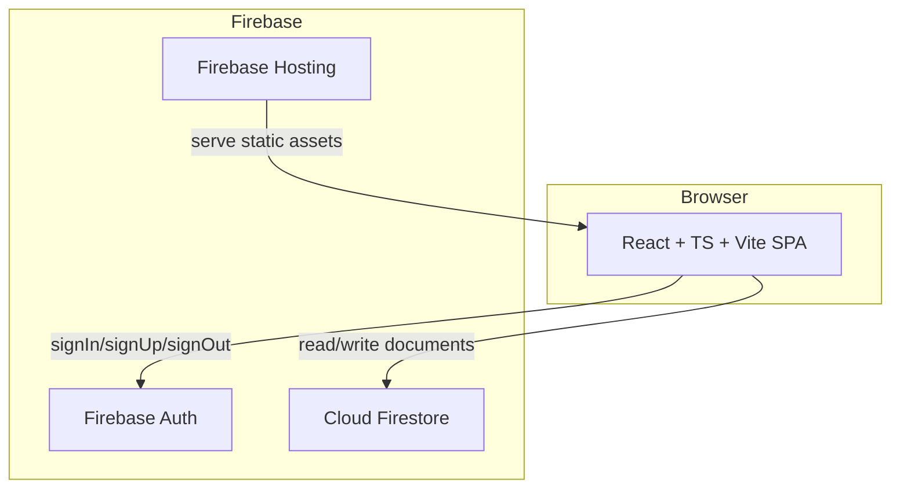
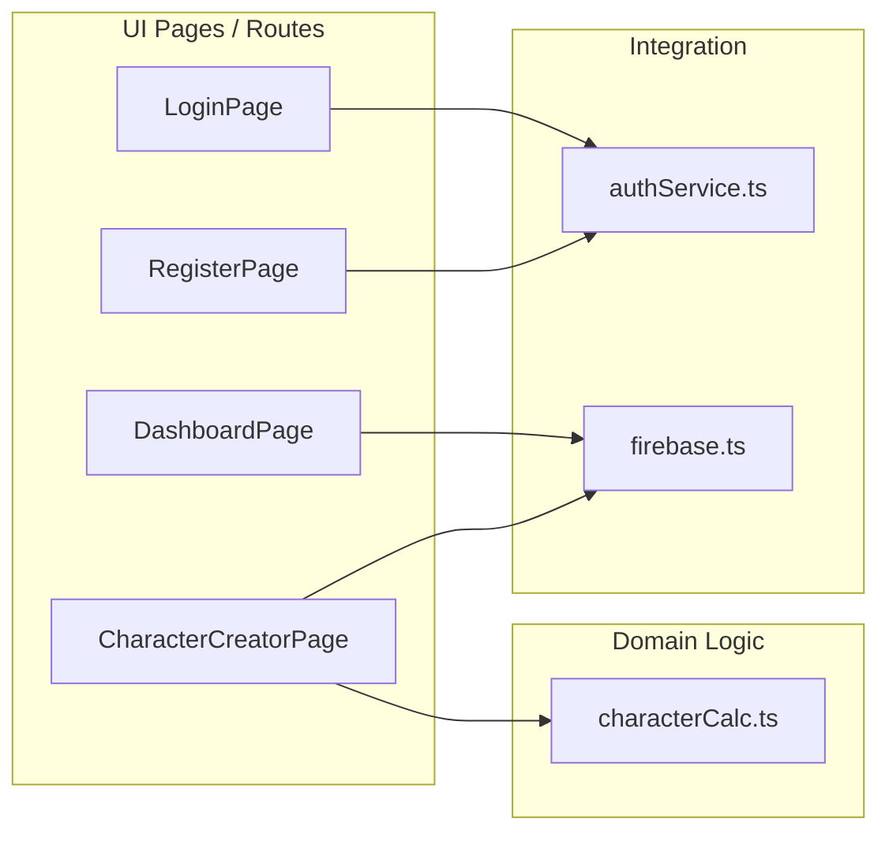
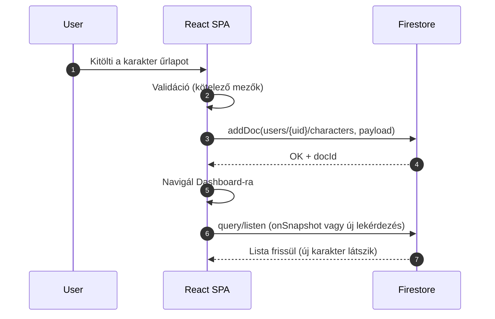

# 1) Software Architecture Document (SAD) — *Anima Character Builder*

**Projekt:** Anima Character Builder (szakdolgozati MVP)  
**Verzió:** v0.1 (Sprint 2 MVP-hez)  
**Dátum:** 2026-01-29  
**Státusz:** Draft  
**Közönség:** fejlesztők, architekt, konzulens/bírálók  

---

## 1. Kontextus és cél

Az Anima Character Builder célja egy **gyorsan publikálható, interneten azonnal használható MVP**, amelyre később bővíthető szabálymotor és további karakterlap-funkciók épülnek. A tech stack döntés a **minimális üzemeltetési overhead** és **gyors iteráció** miatt született: React (Vite) + Firebase (Auth + Firestore + Hosting).

### 1.1 MVP fókusz (Sprint 2)

A Sprint 2 vertikális szelet: **bejelentkezett felhasználóként új karakter létrehozása és Firestore-ba mentése, majd megjelenítés a saját listában**.

### 1.2 Fő stakeholderek

- **Végfelhasználó:** bejelentkezik, karaktert hoz létre/ment/betölt  
- **Fejlesztő:** gyors lokális preview, tesztelhetőség (emulator), CI kompatibilitás  
- **Értékelők:** nyomonkövethető döntések (ADR), AI-log, DoD, tesztek  

---

## 2. Követelmények és minőségi attribútumok

### 2.1 Funkcionális (rövid)

- Auth (login/logout), auth guard  
- Karakterlista a user saját kollekciójából  
- Új karakter létrehozása validációval és mentéssel Firestore-ba  
- Referencia adatok betöltése (config/races/classes)  

### 2.2 Nem-funkcionális (MVP-szint)

- **Gyors iteráció / reprodukálhatóság**: lokális preview + opcionális emulator  
- **CI stabilitás**: lint/typecheck/build + terraform validate/plan  
- **Alap adatvédelem**: per-user elkülönítés (cél: security rules “uid ownership”)  
  *(Megjegyzés: a jelenlegi `firestore.rules` a zip-ben még “nyitott” jellegű és időkorlátos – ezt lent külön kockázatként kezelem.)*

---

## 3. Architektúra áttekintés

### 3.1 Architektúra stílus

- **SPA (Single Page Application)**: React + TypeScript + Vite  
- **BaaS**: Firebase Authentication + Cloud Firestore + Firebase Hosting  
- **No dedicated backend** az MVP-ben (később opció: Cloud Functions)  

### 3.2 Fő komponensek (magas szinten)

- **UI réteg (React oldalak):**
  - Login, Register  
  - Dashboard (karakterlista)  
  - CharacterCreator (új karakter)  
  - CharacterDetail / Edit / Game (kód jelenleg is megvan a repo-ban)  
  - Encyclopedia, Profile  
- **Domain / számítási logika:**
  - `characterCalc.ts` (szabályok, derived statok, segédfüggvények)  
- **Integráció:**
  - `firebase.ts` (init + emulator switch)  
  - `authService.ts` (auth műveletek)  

---

## 4. C4 modellezés

### 4.1 C1 — System Context diagram

```mermaid
flowchart LR
  U[Felhasználó (Browser)] -->|HTTPS| APP[Anima Character Builder (SPA)]
  APP -->|Auth API| AUTH[Firebase Authentication]
  APP -->|CRUD| FS[Cloud Firestore]
  APP -->|Static hosting| HOST[Firebase Hosting]
```

**Lényeg:** a rendszer kliensoldali SPA, a “backend” szerepet az Auth és a Firestore tölti be.

---

### 4.2 C2 — Container diagram



**Lokális fejlesztés:** Vite dev server (`localhost:5173`), opcionálisan Firebase Emulator Suite Auth+Firestore-hoz.

---

### 4.3 C3 — Component diagram (SPA-n belül, MVP szempontból)



---

## 5. Fő felhasználói folyamatok

### 5.1 Auth guard + karakterlista (US-01 / US-02)

- Ha nincs bejelentkezve → login (guard)  
- Bejelentkezve → Dashboard betölt, listáz a `users/{uid}/characters` alól  

### 5.2 Új karakter mentése (AC-03)



Ez explicit célja a Sprint 2 MVP szeletnek.

---

## 6. Adatmodell (logikai áttekintés)

### 6.1 Fő kollekciók (MVP)

- **Per-user karakterek:** `users/{uid}/characters/{characterId}`  
- **Referencia / master data:** pl. `config/*`, `races/*`, `classes/*`  

### 6.2 Modell-elv

- “**Character = egy dokumentum**” + kontrollált denormalizáció, a komplexitás főleg **szabály/számítás logika** a frontenden.

---

## 7. Biztonság (MVP-szint + aktuális kockázat)

### 7.1 Célállapot (elv)

- User csak a saját útvonala alatt olvashat/írhat: `request.auth.uid == uid`  
- Referencia adatok tipikusan read-only (vagy admin-only)

Ezt a product spec is kiemeli mint kritikus kockázat/mitigáció (“ownership rules + emulator teszt”).

### 7.2 Aktuális állapot (zip alapján)

- A repo-ban lévő `firestore.rules` **időkorlátos, kvázi nyitott** (default template jelleg).  
  **Következmény:** éles környezetben ez nem maradhat így.

### 7.3 Javasolt minimál rules (SAD-ben rögzítendő cél)

- `users/{uid}/characters/{doc}`: read/write csak `request.auth.uid == uid`  
- `config|races|classes`: read = true, write = false (vagy admin-only)

*(A Security Documentation-ban — #20 — majd konkrét rules blokkot és threat modellt is leírunk.)*

---

## 8. Fejlesztési és futtatási környezet

### 8.1 Local preview (fejlesztői alap)

- `npm install`  
- `npm run dev` → Vite dev server  
- Opcionális: Firebase Emulator Suite (Auth/Firestore), determinisztikus tesztekhez  

### 8.2 CI / IaC (Sprint 2 követelmény)

- Terraform: **plan-only** (`fmt/validate/plan`), apply nélkül  

---

## 9. Tesztelési stratégia (architektúrához kapcsolva)

A repo-ban több szint látszik:

- **Unit** (pl. karakter számítások)  
- **Smoke** (Firestore emulator host környezetváltozókkal)  
- **E2E** (Cucumber + emulator + seed)  

A részleteket a **“Testing Documentation” (#19)** dokumentumban bontjuk ki.

---

## 10. Kockázatok és technikai adósság (top)

1. **Firestore rules nyitottság / security hardening hiány** → prior 1 (biztonság).  
2. **Vendor lock-in (Firebase)** → vállalt kockázat MVP-ért.  
3. **Komplex riportok / join hiánya** → későbbi export vagy célzott backend/SQL opció.  

---

## 11. Hivatkozott döntések (ADR-ek)

- Tech stack váltás és indoklás:  0002-second-tech-choice.md
- Platform / local preview + Firebase (emulator opció):  0003-platform.md
- IaC stratégia (Terraform plan-only):  0004-iac-strategy.md
