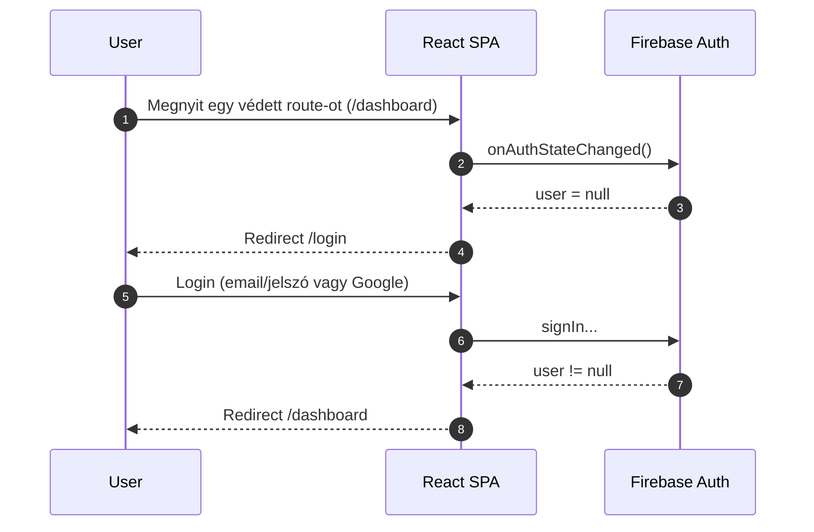
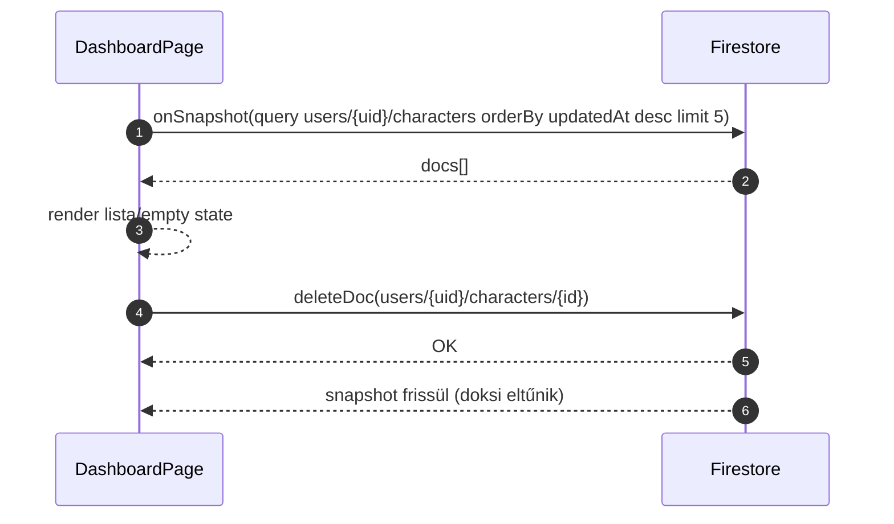
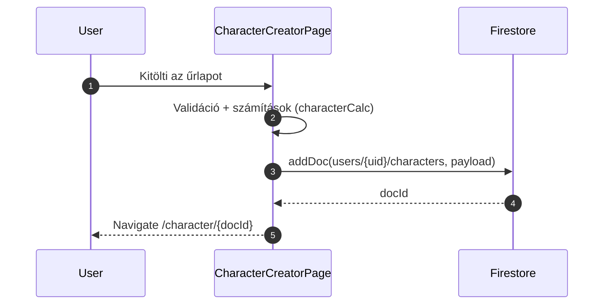

# 2) System Design Document (SDD) — *Anima Character Builder*

**Projekt:** Anima Character Builder (szakdolgozati MVP)  
**Verzió:** v0.1 (Sprint 2 MVP-hez)  
**Dátum:** 2026-01-29  
**Státusz:** Draft  
**Közönség:** fejlesztők  

---

## 1. Cél és terjedelem

A System Design Document célja, hogy **komponens-szintű** (SPA-n belüli) bontásban rögzítse az MVP működését, felelősségi köröket, fő adatfolyamokat, és a Firestore integráció pontos mintáit.

**Sprint 2 vertikális szelet (MVP fókusz):**
- Auth (login/register/logout) + route guard
- Dashboard: user saját karaktereinek listázása (`users/{uid}/characters`)
- Új karakter létrehozása validációval és Firestore mentéssel
- Referencia adatok betöltése Firestore-ból (`races`, `classes`, `config/*`)

---

## 2. Tech stack és fő design constraint-ek

- **Frontend:** React + TypeScript + Vite (SPA)
- **BaaS:** Firebase Authentication + Cloud Firestore + Firebase Hosting
- **Backend:** nincs dedikált backend az MVP-ben  
  *(későbbi bővítés: Cloud Functions, vagy külön API réteg)*

**Kiemelt constraint:**
- A kliensoldali SPA közvetlenül hívja az Auth és Firestore SDK-kat, ezért a **biztonsági modell** gerince a Firestore Security Rules + Auth state.

---

## 3. Rendszer felbontás (modulok és felelősségek)

### 3.1 Forrásfa (releváns)

```
src/
  App.tsx
  main.tsx
  firebase.ts
  authService.ts
  DashboardPage.tsx
  CharacterCreatorPage.tsx
  CharacterDetailPage.tsx
  CharacterEditPage.tsx
  CharacterGamePage.tsx
  LoginPage.tsx
  RegisterPage.tsx
  ProfilePage.tsx
  EncyclopediaPage.tsx
  characterCalc.ts
tests/
  unit/
  smoke/
  e2e/
scripts/
  seed-data/
  export-firestore-doc.mjs
infra/terraform/
```

### 3.2 Modulok

#### A) `firebase.ts` — Firebase init + emulator toggle
**Felelősség:**
- Firebase App inicializálás env változókból
- `auth`, `db` singleton export
- Emulator kapcsolás `VITE_USE_EMULATORS=true` esetén:
  - Auth emulator: `http://127.0.0.1:9099`
  - Firestore emulator: `127.0.0.1:8080`
- Analytics lazy init (ha támogatott)

**Környezeti változók (Vite):**
- `VITE_FIREBASE_API_KEY`
- `VITE_FIREBASE_AUTH_DOMAIN`
- `VITE_FIREBASE_PROJECT_ID`
- `VITE_FIREBASE_STORAGE_BUCKET`
- `VITE_FIREBASE_MESSAGING_SENDER_ID`
- `VITE_FIREBASE_APP_ID`
- `VITE_FIREBASE_MEASUREMENT`
- `VITE_USE_EMULATORS` (`"true"|"false"`)

---

#### B) `authService.ts` — Auth use-case wrapper
**Felelősség:**
- Email/jelszó login és regisztráció
- Google popup login
- Logout
- Session persistence kiválasztás “remember me” szerint

**Publikus API:**
```ts
loginWithEmail(email: string, password: string, rememberMe?: boolean): Promise<UserCredential>
registerWithEmail(email: string, password: string, rememberMe?: boolean): Promise<UserCredential>
loginWithGoogle(rememberMe?: boolean): Promise<UserCredential>
logout(): Promise<void>
```

**Persistencia logika:**
- `rememberMe=true` → `browserLocalPersistence`
- `rememberMe=false` → `browserSessionPersistence`

---

#### C) `App.tsx` — Routing + Auth guard
**Felelősség:**
- Route definíció (`react-router-dom`)
- Bejelentkezés függő hozzáférés (guard)
- Authed user redirect login/register oldalról

**Belső építőelemek:**
- `useAuthUser()` → `onAuthStateChanged(auth, ...)` alapján ad `{ user, loading }`
- `RequireAuth` → ha nincs user: redirect `/login`
- `RedirectIfAuthed` → ha van user: redirect `/dashboard`

**Route térkép (MVP+):**
- Public:
  - `/login`
  - `/register`
- Protected (RequireAuth):
  - `/dashboard`
  - `/new-character`
  - `/character/:id`
  - `/character/:id/edit`
  - `/character/:id/game`
  - `/profile`
  - `/encyclopedia`

---

#### D) `characterCalc.ts` — Domain / szabálymotor (kliensoldali)
**Felelősség:**
- Stat/skill számítások, derived értékek
- Cost/limit számítások (DP, creation points, stb.)
- Normalizáló segédfüggvények a Firestore-ból jövő „nyers” adatokhoz

**Megjegyzés:** a modul önállóan unit tesztelt (`tests/unit/characterCalc.test.ts`).

---

## 4. Firestore adat-hozzáférési minták

### 4.1 Gyűjtemények és útvonalak

**User scoped:**
- `users/{uid}/characters/{characterId}`

**Referencia / master data:**
- `races/{raceId}`
- `classes/{classId}`
- `config/{docId}` (docId példák: `skills`, `levelrules`, `movement`, `fatigue`, `advantages`, `disadvantages`, stb.)

### 4.2 Olvasási stratégia

- Dashboard: **valós idejű lista** `onSnapshot(query(...))`
- Character detail: **egyszeri lekérés** `getDoc(doc(...))`
- Creator config: **induláskor batch betöltés** `Promise.all([...])`

### 4.3 Írási stratégia

- Új karakter: `addDoc(collection(db, "users", uid, "characters"), payload)`
- Delete: `deleteDoc(doc(db, "users", uid, "characters", id))`
- Timestamp: `serverTimestamp()` (`createdAt`, `updatedAt`)

---

## 5. Komponens-szintű design (MVP fókusz)

### 5.1 DashboardPage — karakterlista + limit + delete

**Funkciók:**
- Auth state-ből `uid` meghatározása
- User karaktereinek listázása (max 5)
- Delete művelet user scoped doc úton
- Navigáció:
  - Új karakter: `/new-character`
  - Részletek: `/character/:id`

**Firestore lekérdezés:**
```ts
const q = query(
  collection(db, "users", uid, "characters"),
  orderBy("updatedAt", "desc"),
  limit(5)
);
onSnapshot(q, ...)
```

**UI állapotok:**
- `loading` while snapshot inicializál
- `empty state` ha nincs karakter
- `isLimitReached` ha `characters.length >= 5`

---

### 5.2 CharacterCreatorPage — referencia adatok + validáció + mentés

**Funkciók (magas szint):**
- Auth state-ből `uid` meghatározása
- Referencia adat betöltés Firestore-ból:
  - `races` kollekció
  - `classes` kollekció
  - `config/*` dokumentumok (skills, levelrules, movement, fatigue, advantages, disadvantages)
- Form state (név, szint, kaszt, race, primary stats, skill base, combat base, előnyök/hátrányok)
- Számított mezők a `characterCalc.ts` alapján
- Mentés Firestore-ba user scoped útvonalra

**Referencia adat betöltés (minta):**
```ts
const [r, c, skillsDoc, lrDoc, mvDoc, fatDoc, advDoc, disDoc] = await Promise.all([
  loadCollection<RaceDef>("races"),
  loadCollection<ClassDef>("classes"),
  loadConfigDoc({ col: "config", id: "skills" }),
  loadConfigDoc({ col: "config", id: "levelrules" }),
  loadConfigDoc({ col: "config", id: "movement" }),
  loadConfigDoc({ col: "config", id: "fatigue" }),
  loadConfigDoc({ col: "config", id: "advantages" }),
  loadConfigDoc({ col: "config", id: "disadvantages" }),
]);
```

**Validáció (minimum):**
- `name.trim()` nem üres
- `level` kiválasztva
- `classId` kiválasztva
- (opcionális) további mezők: a creator UI már számol DP/CP korlátokat

**Mentett dokumentum (payload) — fő mezők:**
- `version`
- `name`
- `level`, `xp`
- `classId`, `className`, `archetype`
- `raceId`
- `rulesSnapshot` (osztály/race snapshot + config hivatkozások)
- `primary` (base primary)
- `secondary.skillBase`
- `combat.*.base` + `lifePoints.multiples`
- `dp` összesítők
- `creationPoints` összesítők
- `advantages`, `disadvantages`
- `createdAt`, `updatedAt` (server timestamps)

**Mentés utáni navigáció:**
- Sikeres `addDoc` után: `navigate(/character/{docId})`

---

### 5.3 CharacterDetailPage — karakter betöltés + derived értékek

**Funkciók:**
- Auth state-ből `uid`
- `id` paraméterből doc id
- `getDoc(doc(db, "users", uid, "characters", id))`
- Kliensoldali derived statok kalkulációja (calc modul)

**Megjegyzés:** az MVP szeletben a detail a mentés utáni „bizonyíték” felület (a doc megjelent és értelmezhető).

---

## 6. Fő adatfolyamok (diagramok)

### 6.1 Login + guard (route védelem)



### 6.2 Dashboard lista + delete



### 6.3 Új karakter mentés (Sprint 2 core)



---

## 7. Hibakezelés és állapotmenedzsment

- Oldalszintű `loading` (auth state, snapshot inicializálás, config betöltés)
- „Best-effort” UI: hiba esetén `alert()` + konzol log
- A config betöltésnél „alive” flag minta a race condition elkerülésére (unmount eset)

**Későbbi fejlesztési opciók:**
- Egységes toast/notification komponens
- Hibakódok normalizálása (Auth error codes, Firestore error codes)

---

## 8. Biztonsági design (MVP realitás)

**Aktuális rules (repo):** időkorlátos „nyitott” szabály 2026-02-25-ig.  
Ez fejlesztési gyorsításra jó, de éles környezetben nem tartható.

**Célállapot (minimum):**
- `users/{uid}/characters/{doc}`: read/write csak ha `request.auth.uid == uid`
- `races/*`, `classes/*`, `config/*`: read-only (write tiltott vagy admin-only)

*(A részletes, konkrét rules blokk a #20 Security Documentation dokumentumba kerül.)*

---

## 9. Tesztelhetőség (design ↔ tesztek kapcsolata)

- **Unit:** `characterCalc.ts` logika (determinista számítások)
- **Smoke:** Firestore elérés emulator környezetben
- **E2E (Cucumber):** seed → auth → create character → dashboard ellenőrzés

**Design cél:** emulátor kapcsolóval a CI és lokális futás determinisztikussá tehető.

---

## 10. Nyitott kérdések / következő lépések

1. Security Rules hardening (prior 1)
2. Update flow (CharacterEdit) – `updateDoc` design és audit (`updatedAt`)
3. Verziózás a `version` mező alapján: migrációs stratégia dokumentálása
4. Observability minimum: error logging és basic analytics események

---
